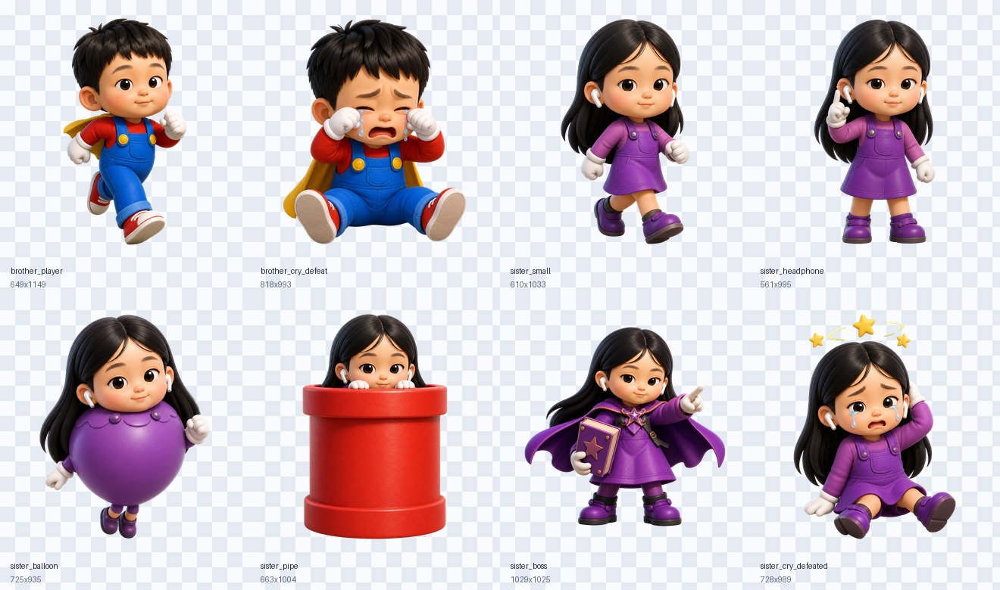
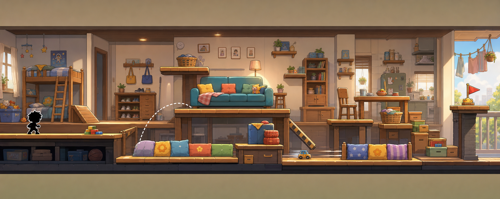
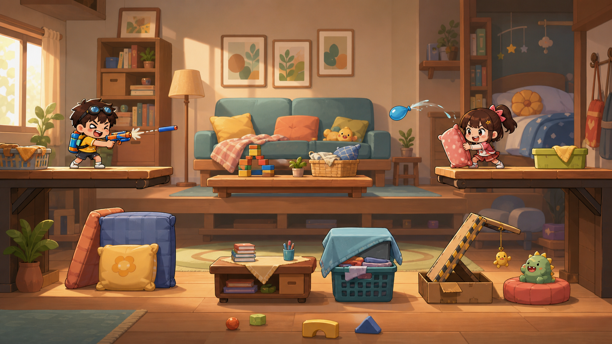

# 弟弟打姐姐 · Brother vs Sister

> 一款用爱制作的姐弟大战休闲动作小游戏。
> A small action game made with love — siblings, snowballs, and a whole lot of chaos.




---

## 中文

### 项目简介
《弟弟打姐姐》是一款**网页 2D 横版动作游戏**,讲的是弟弟雪地里"偷袭"姐姐的爆笑日常。玩家扮演弟弟,利用雪球、玩具、加速鞋等道具,躲开姐姐远程投掷的拖鞋、笔记本、痒痒挠,在 10 个关卡里完成从「偷偷靠近」到「绝地反击」的逆袭。

### 核心特色
- 🎯 **10 个关卡,递进难度**:第 1 关教学,最后一关 4 倍速姐姐 + 全屏弹幕。
- 🩴 **姐姐的武器库**:拖鞋、笔记本、痒痒挠、抱枕……还会翻滚攻击。
- 🎁 **6 大道具**:雪球 / 玩具熊 / 加速鞋 / 盾牌 / 磁铁 / 隐身披风,各有特殊效果。
- 🏆 **成就系统**:「一击命中」「无伤通关」「道具大师」等 15 个成就可以解锁。
- 💾 **本地存档**:关卡进度、徽章、个人最佳成绩自动保存在浏览器里。
- 🎵 **原创音乐**:8-bit 风电子配乐,关卡越紧张节奏越快。
- 📱 **键盘 / 触屏双操作**:方向键移动,空格投掷,Shift 加速,触屏用户有专属按钮。

### 如何运行
```bash
npm install
npm run dev
```
然后在浏览器打开 [http://localhost:18473](http://localhost:18473) 即可开战。
构建生产版本:`npm run build`,产物在 `dist/` 目录。

### 关卡一览





### 完结画面

| 胜利 | 失败 |
| --- | --- |
|  |  |

### 一起做
这是一个**完全开放**的小项目,欢迎任何人贡献——不论你是设计师、程序员、音效师还是文案:
- 🐛 报告 Bug / 提建议:直接在仓库开 Issue。
- 🎨 做关卡、写代码、做图、做音乐、做翻译,任何贡献都欢迎。
- 📝 改文案、补 README、帮忙改错别字,也是大大的支持。

> 这个游戏的目标很单纯:让姐姐玩一次先笑后气,让弟弟玩一次先得意后挨揍。Happy fighting!

### 许可
本项目以 **MIT 协议**开源,你可以自由使用、修改、再发布。详见 `LICENSE`(可选)。

---

## English

### About
**Brother vs Sister** is a tiny 2D side-scrolling action game about a younger brother's snowy "ambushes" of his older sister. Throw snowballs, dodge flying slippers, and survive 10 increasingly unhinged levels.

### Features
- **10 levels** with ramping difficulty — gentle tutorial to a 4×-speed final boss rush.
- **Sister's arsenal**: slippers, notebooks, back-scratchers, pillows, and the dreaded rolling tackle.
- **6 power-ups**: snowballs, teddy bombs, speed shoes, shields, magnets, and the invisibility cloak.
- **15 achievements** — from "One-Hit Wonder" to "Untouchable".
- **Local saves** for level progress, badges, and personal bests.
- **Original 8-bit soundtrack** that intensifies as the stakes rise.
- **Keyboard & touch controls** — arrow keys to move, Space to throw, Shift to dash.

### How to Run
```bash
npm install
npm run dev
```
Then open [http://localhost:18473](http://localhost:18473) in your browser.
For a production build: `npm run build` (output in `dist/`).

### Screenshots

| Start | Victory | Game Over |
| --- | --- | --- |
|  |  |  |


### Contributing
This is an **open, friendly, low-stakes** project. Pull requests of any size are welcome — bug fixes, new levels, new items, art, music, translations, and even typo fixes in this README. Open an issue first if you want to discuss a bigger idea.

> The goal is simple: make the sister laugh first, then yell, and the brother gloat, then get grounded. Happy fighting!

### License
Released under the **MIT License** — see `LICENSE` (optional). Free to use, modify, and redistribute.
